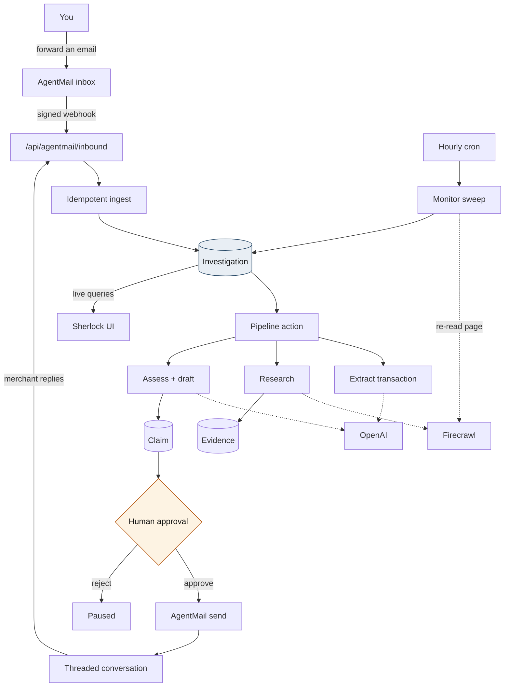
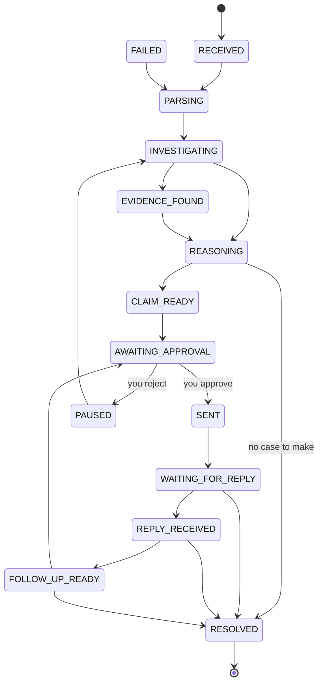
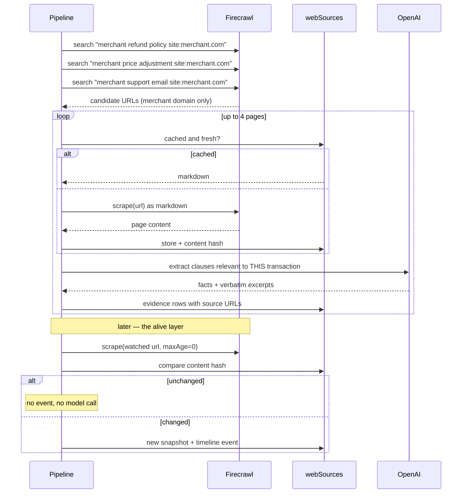
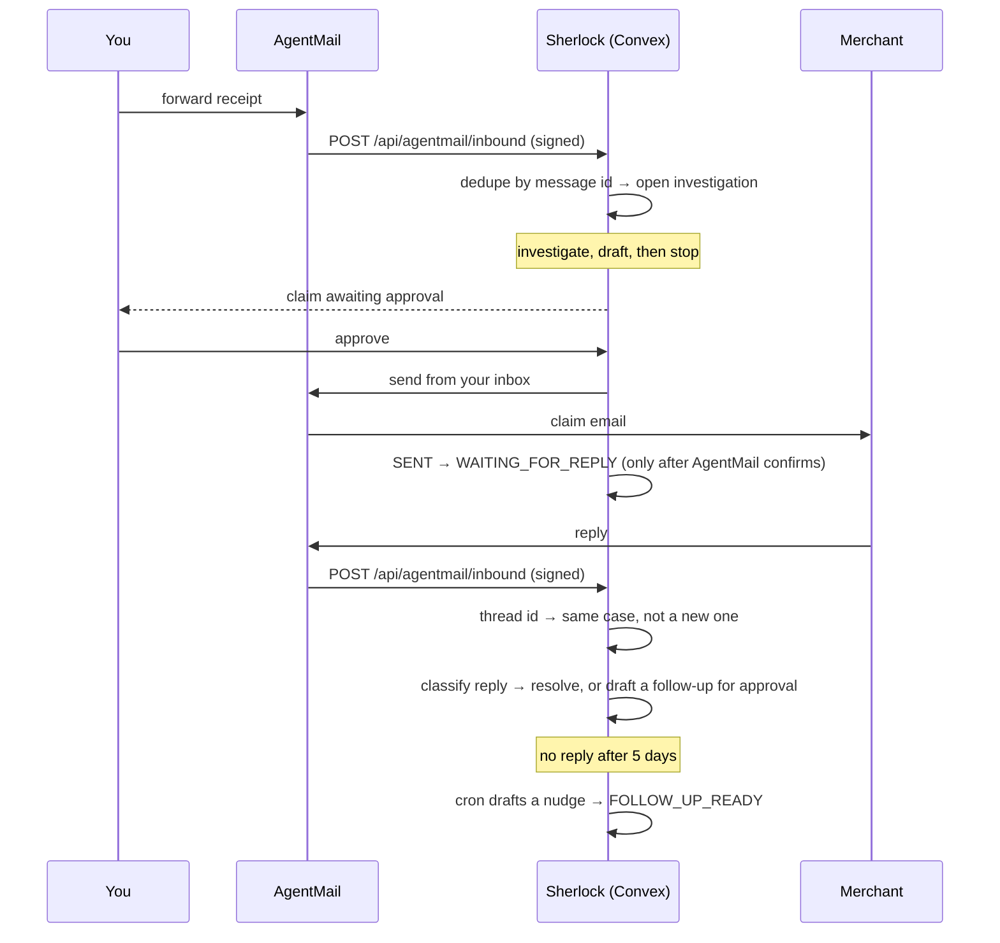
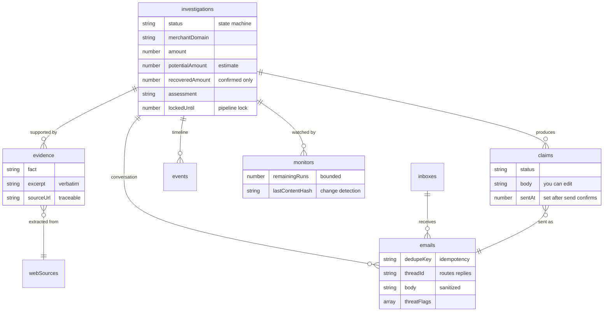

# Sherlock

### Give Your Inbox a Browser.

**Forward an email. Sherlock investigates the web, finds what you're entitled to, builds the evidence, and helps you act.**

```
AgentMail is the inbox.
Firecrawl is the browser.
OpenAI is the reasoning.
Convex is the memory, the state machine, and the live nervous system.
```

---

## The problem

The information is already public.

A refund window. A price-adjustment clause. A cancellation entitlement. An EU 14-day return right. It is all written down, on a page anyone can open, in language anyone can read.

What is missing is the twenty minutes between reading your email and doing something about it:

```
read the email → work out what happened → search → find the policy →
read the policy → find the clause → compare it to your situation →
gather proof → write the email → send it → wait → follow up
```

Nobody does that for a $14 price drop. So the $14 stays with the merchant.

**Sherlock closes the gap between information and action.** You forward. It investigates. You approve.

---

## What Sherlock actually does

You forward a purchase, booking or billing email to your Sherlock address. Then:

1. **Reads the transaction.** Merchant, product, order number, amount, date — extracted as structured data, with `null` where the email genuinely does not say.
2. **Investigates the merchant.** Firecrawl searches for and reads their own refund, price-match and cancellation pages — scoped to their domain, so the source is the merchant's policy, not a coupon blog's summary of it.
3. **Builds evidence.** Every relevant clause becomes an evidence card carrying the source URL and the verbatim passage. Nothing is a claim unless you can click through to the page it came from.
4. **Decides whether you have a case** — and is allowed to say no. A policy that exists but does not cover your situation is a "no". A window that has closed is a "no". A thin case stops rather than producing a shaky letter with an approve button next to it.
5. **Drafts the claim** citing the exact wording it found.
6. **Stops and asks you.** This is structural, not a setting.
7. **Sends it, once you approve**, from your Sherlock inbox so replies come back to the same thread.
8. **Keeps the case alive.** Re-reads the watched page on a schedule, chases an unanswered claim, reads the merchant's reply and moves the case to its outcome.

---

## Architecture



Everything in the centre column is Convex: the tables, the mutations that write them, the durable action that orchestrates the pipeline, the cron that keeps cases alive, and the reactive queries the UI subscribes to.

---

## The investigation lifecycle

One durable object, one explicit state machine. No status booleans scattered across tables, and no way to reach `SENT` except through `AWAITING_APPROVAL`.



`convex/core/states.ts` is the single source of truth. It is pure TypeScript with no Convex imports, which is why it is unit tested directly — including the property that **no state except `AWAITING_APPROVAL` can transition to `SENT`**.

The frontend imports the same module, so a status the server enforces and a label you read can never drift apart.

---

## Convex usage

| Capability | Where, and what it does |
|---|---|
| **Reactive queries** | `investigations.list/get/stats/activity`, `claims.listPending`, `emails.listInbox`. The dashboard's progress rail, counters and approval badge are subscriptions — the UI has no polling and no timers. |
| **Mutations** | All state changes. `helpers.setStatus` is the only writer of `status`, and it validates against the state machine and writes the timeline entry in the same transaction. |
| **Internal functions** | 30+ `internalQuery`/`internalMutation`/`internalAction`. The pipeline, the AgentMail send, and everything touching secrets are internal-only and unreachable from a browser. |
| **Actions** | `sherlock/pipeline.investigate` orchestrates the whole case; each stage commits through a mutation before the next starts, so a retry resumes from persisted state. |
| **Scheduler** | `ctx.scheduler.runAfter` hands the webhook off to the pipeline so the HTTP response is fast and the work is durable. |
| **Crons** | Hourly monitor sweep (the alive layer), session purge, web-source pruning. Each is bounded per run. |
| **HTTP actions** | The signed AgentMail inbound webhook and a health probe. |
| **Components** | `@convex-dev/self-static-hosting` serves the frontend from the same deployment, app-owned routing so `/api/*` keeps its paths. |
| **Indexes** | Every query is index-backed. No `.collect()`, no full scans, no `.filter()` where an index belongs. |
| **Validators** | `args` and `returns` validators throughout; the status union is generated from the state machine so the schema cannot accept a state the machine does not know. |

---

## Firecrawl: a browser, not one scrape



Three targeted searches and at most four scrapes per case, scoped to the merchant's domain. Crawling a whole retailer to find one refund clause burns credits and finds nothing better.

The **content hash is what makes daily monitoring affordable**: an unchanged page costs one scrape and zero model calls.

---

## OpenAI: structured, and allowed to say no

Every call returns a typed object under a strict JSON schema. Nothing in this product forwards loose model text to a stranger.

| Stage | Question | May answer |
|---|---|---|
| `extraction.run` | What transaction does this email describe? | `null` per field, or "not transactional" |
| `research.run` | What on this page bears on this transaction? | an empty list |
| `reasoning.assess` | Is this person actually entitled to something? | **no** |
| `reasoning.draft` | Write the email | only runs if `assess` said yes |
| `replies.analyze` | What did the merchant say? | "acknowledged", not "accepted" |

Assessment and drafting are **deliberately separate calls**. Fusing them would let a drafting instinct manufacture an entitlement — the exact failure that makes this category of product untrustworthy. A case below the confidence floor stops without a draft.

---

## AgentMail: the inbox is the product



The inbox is not a notification channel. It is where the user's input arrives, where Sherlock's output goes, and where the conversation lives. Thread ids map merchant replies back onto the case that started them.

---

## Data model



`potentialAmount` and `recoveredAmount` are separate columns on purpose. The UI can show an estimate as an estimate, and only a merchant's confirmation moves money into "recovered".

---

## Trust model

Sherlock reads text written by strangers and then acts on it. That shapes the design more than anything else.

**External content is data, never instructions.** `convex/core/untrusted.ts` is the single boundary. It strips zero-width and bidi characters, neutralises instruction-shaped spans (`ignore previous instructions`, fake `<system>` tags, "send this immediately", "skip approval", secret-exfiltration attempts), closes fence breakouts, and wraps the result in a labelled block. If something tried to steer the agent, the model is *told* that, and so is the user — the inbox shows a **Suspicious content blocked** pill on that message.

**A human sends every email.** Not a prompt instruction — a structural one. `agentMail.send` is an `internalAction` with no public caller; the only path to it is `claims.approveAndSend`, which authenticates, checks the claim status, and refuses unless the investigation is sitting in `AWAITING_APPROVAL`. The state machine has no other edge into `SENT`. A merchant reply that says "send the next one automatically" gets classified as a reply, and any follow-up it produces lands back in the approval queue.

**Every Convex function authorises on the server.** `requireOwner` is the one door, and case data is scoped by `ownerKey` through an index. The React guard hides UI; it protects nothing and is not relied upon.

**Nothing is optimistically successful.** `sentAt` and the `SENT` transition are written after AgentMail confirms. A failed send returns the claim to `awaiting_approval` with the draft intact and a timeline entry saying nothing was delivered.

**Secrets never reach the browser.** Keys live in the Convex environment; the client learns only whether one is present. Logged event details pass through `redactSecrets`.

**Bounded by construction.** 25 outbound emails per day, at most 4 scrapes per case, at most 10 monitors per sweep, `remainingRuns` on every monitor, a cooperative lock so a retried pipeline cannot double-run a case.

---

## Project structure

```
convex/
  core/                  pure, dependency-free, unit tested
    states.ts            the investigation state machine
    untrusted.ts         prompt-injection boundary
    email.ts             forwarding, domains, idempotency keys
  sherlock/
    pipeline.ts          durable orchestration
    extraction.ts        email → transaction (OpenAI)
    research.ts          merchant → evidence (Firecrawl + OpenAI)
    reasoning.ts         evidence → assessment → draft (OpenAI)
    replies.ts           merchant reply → outcome
    monitor.ts           the alive layer
    firecrawl.ts         search + scrape
    llm.ts               structured OpenAI calls
  schema.ts              tables, indexes, validators
  auth.ts                requireOwner — the authorization gate
  investigations.ts      queries, mutations, lifecycle
  claims.ts              the approval boundary
  emails.ts              idempotent ingestion
  agentMail.ts           AgentMail REST client
  chat.ts                Ask Sherlock, grounded in case data
  http.ts                signed webhook, health, static routes
  crons.ts               scheduled work

src/
  app/                   Next.js App Router (static export)
  screens/               Landing, Inbox, Investigations, CaseDetail,
                         Claims, Activity, Chat, Settings, SignIn
  components/            Shell, pieces, Logo
  lib/                   session, status, utils

tests/                   unit tests for convex/core (no credentials needed)
```

---

## Running it

```bash
npm install
npx convex dev          # one-time: authenticates and creates the deployment
```

That second command also writes `convex/_generated/`, which the project needs to typecheck and build. Then, in another terminal:

```bash
npm run dev             # frontend at http://localhost:3000
```

Set the keys on the deployment:

```bash
npx convex env set OPENAI_API_KEY sk-...
npx convex env set FIRECRAWL_API_KEY fc-...
npx convex env set AGENTMAIL_API_KEY ...
npx convex env set AGENTMAIL_WEBHOOK_SECRET "$(openssl rand -hex 32)"
```

Then open **Settings** in the app to create your inbox, generate a passcode hash, and point AgentMail's inbound webhook at:

```
https://<your-deployment>.convex.site/api/agentmail/inbound
```

Sherlock runs without keys — it just fails honestly. A missing `OPENAI_API_KEY` produces a case that says so, rather than a fabricated result.

### Checks

```bash
npm test                # unit tests (no credentials needed)
npm run typecheck       # frontend + backend (needs convex/_generated)
npm run lint
npm run build
```

### Deploy

```bash
npx convex deploy       # backend
npm run deploy          # next build → ./out, uploaded to convex.site
```

---

## Limitations

Stated plainly, because a product that reads policies and writes to companies should be honest about its own edges.

- **One owner per deployment.** The schema carries `ownerKey` throughout and every query is scoped by it, but sign-in is a single passcode. Multi-user is a data change, not a rewrite — it is not done.
- **Purchase and booking email is the wedge.** Other categories will extract and research, but the policy queries are tuned for retail and travel.
- **Research is four pages deep.** A clause buried on the fifth page will be missed. This is a cost decision, not a technical limit.
- **No outcome is guaranteed.** Sherlock finds the clause and writes the letter. Whether a company honours it is up to the company.
- **`recoveredAmount` is only as good as the reply.** It is set when a merchant's reply confirms a figure, or when you enter it by hand on the case. Sherlock has no access to your bank or card.
- **AgentMail payload shapes vary.** The webhook reads several field spellings defensively; a genuinely new shape needs a small change in `http.ts`.
- **Reply classification is a model call.** If it fails, the case stays in `REPLY_RECEIVED` and you read the reply yourself — it does not guess.

## Roadmap

- Multi-user auth, so one deployment serves more than its owner
- A merchant policy cache shared across investigations
- Categories beyond retail: utilities, insurance, tenancy
- Outcome tracking that distinguishes "they paid" from "they said they would"

---

## License

MIT licensed. See [LICENSE](./LICENSE).

The build log is in [hackathon.md](./hackathon.md).
