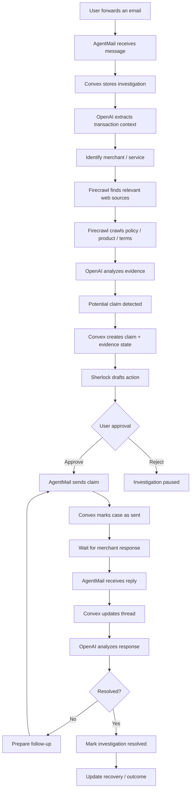
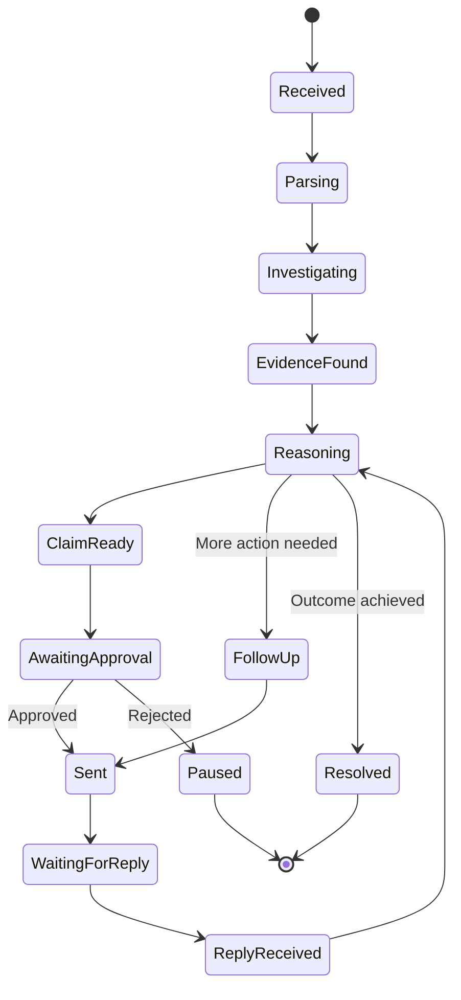
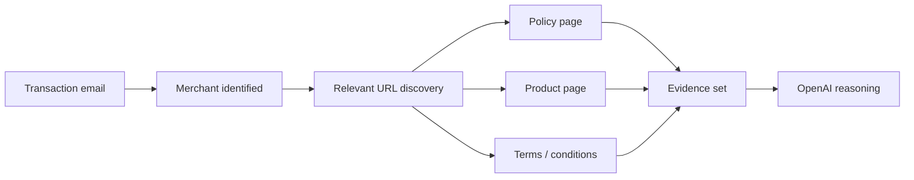
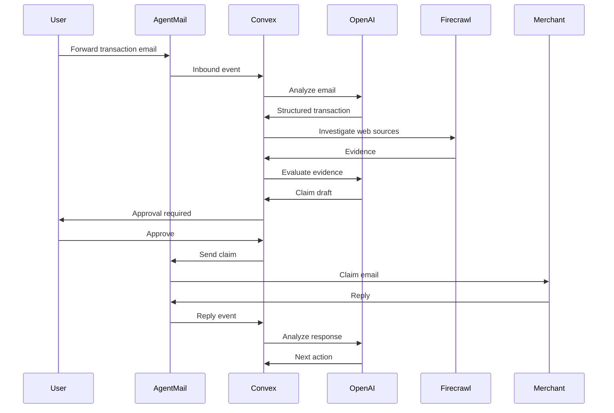
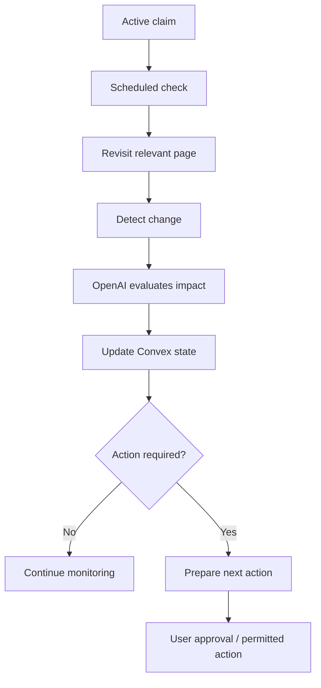
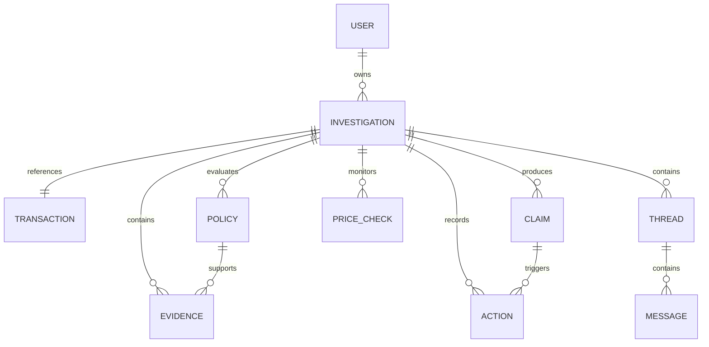
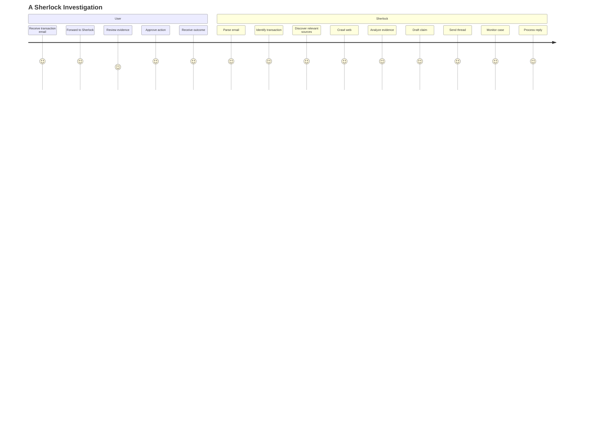
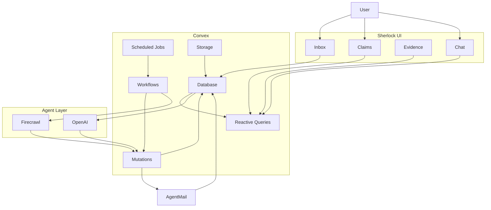
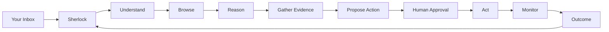

# 🕵️ Sherlock

### Give Your Inbox a Browser.

**Sherlock is an email-native AI agent that investigates the web, finds what you're entitled to, builds the evidence, and helps you act on it.**

Forward an email. Sherlock turns it into an investigation.

> **AgentMail is the inbox.
> Firecrawl is the browser.
> OpenAI is the brain.
> Convex is the memory and realtime nervous system.**

---

[](https://convex.dev/)
[](https://openai.com/)
[](https://firecrawl.dev/)
[](https://agentmail.to/)
[](https://www.typescriptlang.org/)

---

## The Problem

The internet has made buying, booking, subscribing, cancelling, and communicating dramatically easier.

It has also created a new problem:

### **People are constantly entitled to something they never have time to claim.**

A receipt arrives.

A price drops.

A flight gets cancelled.

A subscription changes its terms.

A merchant has a refund or price-adjustment policy.

A company owes you an explanation.

A useful clause is buried inside a 4,000-word policy.

A better price exists somewhere else.

And the user is left with the same workflow:

```text
Read the email
      ↓
Figure out what happened
      ↓
Search Google
      ↓
Find the relevant policy
      ↓
Read the policy
      ↓
Find the relevant clause
      ↓
Compare it with your situation
      ↓
Gather proof
      ↓
Write the email
      ↓
Send it
      ↓
Wait
      ↓
Follow up
      ↓
Repeat
```

The problem is not that the information is unavailable.

### The problem is that the workflow between **information** and **action** is still manual.

Sherlock is built to close that gap.

---

# The Idea

## What if your inbox had a browser?

Traditional assistants wait for you to ask questions.

Traditional email clients store messages.

Traditional web search gives you information.

Traditional automation executes predefined rules.

Sherlock combines these capabilities into one persistent workflow:

```text
                    YOUR EMAIL
                         │
                         ▼
                 ┌──────────────┐
                 │    Sherlock  │
                 └──────┬───────┘
                        │
              Understand the context
                        │
                        ▼
                 Browse the web
                        │
                        ▼
                 Find evidence
                        │
                        ▼
                 Reason about it
                        │
                        ▼
                 Build an action
                        │
                        ▼
                 Ask for approval
                        │
                        ▼
                 Act through email
                        │
                        ▼
                 Keep watching
```

Sherlock does not stop when it finds an answer.

### It follows the problem toward an outcome.

---

# Core Product

The first Sherlock workflow focuses on **purchase and transaction emails**, particularly situations where a user may be entitled to money back.

A user forwards a transaction email to Sherlock.

Sherlock can then:

1. Parse the email and identify the relevant transaction.
2. Extract useful structured facts.
3. Identify the merchant or service.
4. Discover the relevant public policy or terms.
5. Crawl the source material.
6. Extract evidence relevant to the transaction.
7. Determine whether a potential claim exists.
8. Explain the reasoning.
9. Draft a claim.
10. Ask the user for approval.
11. Send the claim through the email thread.
12. Track the conversation.
13. Continue monitoring the case.
14. Update the user when the state changes.

The goal is simple:

> **Turn “I should probably deal with this” into “Sherlock is dealing with this.”**

---

# A Simple Example

### You

Forward a purchase receipt.

### Sherlock

```text
I found:

Merchant: Example Store
Order: #48192
Purchase: $129.99

I found a relevant price-adjustment policy.

A current product price appears to be $109.99.

Potential recovery:
$20.00

Evidence:
✓ Original purchase
✓ Product identity
✓ Current price
✓ Relevant policy clause

Claim draft ready.
```

You approve it.

Sherlock sends the message.

The case becomes:

```text
INVESTIGATING
      ↓
CLAIM READY
      ↓
APPROVED
      ↓
SENT
      ↓
WAITING FOR REPLY
      ↓
RESOLVED
```

The user does not need to remember the case.

Sherlock does.

---

# Why Sherlock Is Different

## 1. Email is the interface

Sherlock does not treat email as a notification channel.

### The inbox is part of the product.

The user can communicate with Sherlock through the same medium that already contains the context Sherlock needs.

---

## 2. The web is an action surface, not just a search box

Sherlock uses the web to investigate the source material needed to complete a task.

It can move from:

```text
Email
  ↓
Merchant
  ↓
Policy
  ↓
Terms
  ↓
Product
  ↓
Evidence
```

This creates a bridge between the user's private context and the public web.

---

## 3. The agent reasons over evidence

Sherlock should not merely return:

> “You may qualify.”

It should be able to explain:

```text
WHAT HAPPENED
      +
WHAT THE POLICY SAYS
      +
WHAT THE EVIDENCE SHOWS
      ↓
WHY THIS ACTION MAKES SENSE
```

The product therefore emphasizes **evidence-backed action**, not opaque automation.

---

## 4. The workflow persists

A normal AI response is often finished after generation.

A Sherlock investigation is not.

```text
Generated answer
      ≠
Completed task
```

Sherlock is designed around the second concept.

---

## 5. It stays alive

A task can remain open after the original interaction.

That means Sherlock can move through a persistent lifecycle:

```text
Received
   ↓
Investigating
   ↓
Claim prepared
   ↓
Sent
   ↓
Waiting
   ↓
Reply received
   ↓
Analyzing
   ↓
Follow-up
   ↓
Resolved
```

This persistent state is where the product's Convex architecture becomes especially important.

---

# Product Philosophy

Sherlock follows five principles.

### **1. Evidence before action**

The system should prefer showing why an action is justified before executing it.

### **2. Human control at consequential moments**

Research can be automated.

Preparation can be automated.

Action can require explicit user approval.

### **3. State is first-class**

An investigation is a durable object, not a transient chatbot response.

### **4. Communication is part of execution**

Sending the message is not an optional add-on. It is part of completing the workflow.

### **5. Background work should create visible value**

Scheduled work exists to move active investigations forward—not to run meaningless automation.

---

# Architecture

Sherlock is designed as a four-layer agent system:

```text
┌──────────────────────────────────────────────────────┐
│                      SHERLOCK                        │
├──────────────────────────────────────────────────────┤
│                                                      │
│  AGENTMAIL                OPENAI                     │
│  Communication            Reasoning                  │
│                                                      │
│  ┌───────────────┐       ┌───────────────────────┐   │
│  │ Inbound email │       │ Extraction             │   │
│  │ Threads       │       │ Classification         │   │
│  │ Outbound mail │       │ Evidence reasoning     │   │
│  │ Replies       │       │ Draft generation       │   │
│  └───────┬───────┘       └───────────┬───────────┘   │
│          │                           │               │
│          └──────────────┬────────────┘               │
│                         ▼                            │
│                    CONVEX                           │
│            Memory / State / Realtime                 │
│                         │                            │
│                         ▼                            │
│                    FIRECRAWL                        │
│             Web investigation layer                 │
│                                                      │
└──────────────────────────────────────────────────────┘
```

---

# Sponsor Stack — By Design, Not Decoration

Sherlock is intentionally structured so each sponsor technology owns a meaningful part of the workflow.

| Technology    | Sherlock role                                                                               |
| ------------- | ------------------------------------------------------------------------------------------- |
| **Convex**    | Persistent state, database, reactive queries, mutations, workflows, scheduled work, storage |
| **OpenAI**    | Extraction, reasoning, classification, evidence interpretation, drafting                    |
| **Firecrawl** | Web discovery, crawling, policy retrieval, source material                                  |
| **AgentMail** | Agent inbox, inbound messages, outbound communication, threaded conversations               |

The important distinction is:

> **Sherlock does not add sponsor technologies after the product was invented. The product is designed around the capabilities they provide.**

---

# 🔄 End-to-End Workflow



---

# 🧠 The Agent Loop

Sherlock's agent loop is designed around:

### **Observe → Investigate → Reason → Propose → Act → Observe**



The critical property is **persistence**.

Sherlock should remember where the investigation is even when the user is not actively interacting with it.

---

# 🌐 Firecrawl: Sherlock's Browser

Sherlock's web layer exists for one reason:

### **Find the information required to make an informed decision.**

A high-level investigation might look like:



Rather than:

```text
scrape → summarize → stop
```

Sherlock is designed for:

```text
discover → crawl → extract → reason → act
```

---

# 📧 AgentMail: The Agent's Inbox

AgentMail is not merely used to notify the user.

It forms the communication backbone of Sherlock.



This makes the email conversation itself a persistent part of the investigation.

---

# ⚡ Convex: Sherlock's Memory

Convex is the system responsible for keeping Sherlock alive across the entire workflow.

Conceptually:

```text
┌─────────────────────────────────┐
│             CONVEX              │
├─────────────────────────────────┤
│ Users                           │
│ Investigations                  │
│ Claims                          │
│ Transactions                    │
│ Policies                        │
│ Evidence                        │
│ Email threads                   │
│ Messages                        │
│ Price checks                    │
│ Actions                         │
│ Workflow state                  │
│ Outcomes                        │
└─────────────────────────────────┘
```

### Reactive UI

When investigation state changes, the interface can reflect it.

```text
Investigating
      ↓
Policy found
      ↓
Evidence ready
      ↓
Approval required
      ↓
Claim sent
      ↓
Waiting
      ↓
Reply received
      ↓
Resolved
```

The goal is not simply to store records.

### The database becomes the living state of the agent.

---

# ⏱️ Scheduled Intelligence

A useful agent should not disappear after sending one email.

For investigations that require continued monitoring, scheduled work can become:

```text
Case active
    ↓
Scheduled check
    ↓
Revisit relevant source
    ↓
Detect meaningful change
    ↓
Evaluate change
    ↓
Update case
    ↓
Take next permitted action
```

Example:



This is the difference between a chatbot and a persistent agent.

---

# 📦 Core Domain Model

A conceptual data model for Sherlock:



### Core entities

#### `users`

Identity and account information.

#### `investigations`

The central durable object representing an active Sherlock case.

#### `transactions`

Structured information extracted from emails.

#### `policies`

Relevant source material discovered from the web.

#### `evidence`

Specific facts or source excerpts used to support a decision.

#### `claims`

Potential or active requests generated from an investigation.

#### `priceChecks`

Scheduled observations tied to an active investigation.

#### `threads`

The external communication history.

#### `messages`

Inbound and outbound email events.

#### `actions`

A durable audit trail of what Sherlock attempted or completed.

---

# 🛡️ Trust & Human Control

Sherlock is designed around a simple principle:

## **Automate investigation before automating consequential action.**

That means the intended default workflow is:

```text
Automatic
─────────
Receive
Parse
Research
Crawl
Extract
Reason
Prepare
        │
        ▼
Human checkpoint
        │
        ▼
Approve
        │
        ▼
Automatic
──────────
Send
Track
Observe
Update
```

This creates a human-readable boundary between:

**what Sherlock discovered**

and

**what Sherlock is allowed to do.**

---

# Evidence-First UX

A claim should not feel like a black-box AI decision.

Sherlock can present:

```text
Potential recovery
$20.00

Why Sherlock thinks this:

✓ Transaction identified
✓ Product matched
✓ Current price found
✓ Relevant policy discovered
✓ Policy appears applicable

Evidence
────────────────────────
Original purchase
Current price
Policy source
Relevant clause
────────────────────────

Draft
────────────────────────
[message preview]
────────────────────────

[Approve & Send]
```

The user should be able to understand the basis for the action before approving it.

---

# 📊 Investigation Dashboard

The dashboard should make the agent's work visible without turning the product into an analytics platform.

A case can show:

```text
Sherlock

$127.40
Potential / Recovered

──────────────────────────────

ACTIVE INVESTIGATIONS

Amazon                  $20
Claim Sent              ●

Example Airline         ₹4,800
Awaiting Reply          ●

Example Store            $14
Resolved                 ✓

──────────────────────────────

6 day activity streak

12 investigations
8 resolved
4 active
```

The visual hierarchy should prioritize:

1. What needs attention
2. What Sherlock is doing
3. What has been recovered
4. What is still active

---

# 💬 Conversational Interface

The conversational surface exists to make asking Sherlock about active investigations effortless.

Example:

```text
You:
Sherlock, what happened with my airline cancellation?

Sherlock:
I found the cancellation thread.

Current status:
Waiting for airline response

Potential claim:
₹4,800

Last action:
Claim sent yesterday.

The airline has not replied yet.
```

Another example:

```text
You:
Why do you think I'm eligible?

Sherlock:
I found three relevant pieces of evidence:

1. Your original transaction
2. The merchant's price-adjustment policy
3. A lower current product price

The policy appears to permit an adjustment under
the conditions attached to your purchase.

[View Evidence]
```

The chat is therefore a control surface for a persistent system—not the product's only form of intelligence.

---

# 🔁 The Complete Sherlock Experience



---

# 🧩 Why This Is a Product, Not an AI Wrapper

A typical AI wrapper:

```text
Input
  ↓
LLM
  ↓
Text
  ↓
Done
```

Sherlock:

```text
Input
  ↓
Context
  ↓
Investigation
  ↓
External evidence
  ↓
Reasoning
  ↓
Decision
  ↓
Human approval
  ↓
Communication
  ↓
Persistent monitoring
  ↓
Outcome
```

That difference is the product.

---

# 🔥 The Product Thesis

Sherlock is based on a simple thesis:

> **The next generation of personal AI will not just answer questions. It will own workflows.**

Email already contains:

* receipts
* booking information
* invoices
* confirmations
* cancellations
* policies
* conversations
* deadlines
* opportunities

The web contains:

* policies
* prices
* documentation
* public information
* terms
* product information

An agent that can connect these two worlds can turn passive information into active outcomes.

```text
EMAIL
  +
WEB
  +
REASONING
  +
MEMORY
  +
COMMUNICATION
  =
PERSONAL ACTION AGENT
```

Sherlock is an implementation of that thesis.

---

# 🏆 Why Sherlock Fits the Convex All Gas Hackathon

The hackathon explicitly prioritizes:

* everyday applications
* creativity and usefulness
* meaningful Convex usage
* meaningful sponsor-stack usage
* a public live product
* social proof
* a concise real-product demo

Sherlock is designed around those requirements rather than bolting the sponsor technologies onto an unrelated project.

### Convex

Persistent investigations, reactive application state, queries, mutations, scheduled workflows, and durable history.

### OpenAI

Understanding messages, extracting structured facts, interpreting evidence, reasoning about potential eligibility, and drafting communication.

### Firecrawl

Web research, policy discovery, source retrieval, and continued investigation of relevant public information.

### AgentMail

The agent's email identity, inbound messages, outbound communication, threads, replies, and follow-through.

The result is one closed loop:

```text
      ┌─────────────┐
      │  AgentMail  │
      │    INBOX    │
      └──────┬──────┘
             │
             ▼
      ┌─────────────┐
      │   CONVEX    │
      │    MEMORY   │
      └───┬─────┬───┘
          │     │
          ▼     ▼
   ┌─────────┐ ┌──────────┐
   │ OpenAI  │ │Firecrawl │
   │  BRAIN  │ │ BROWSER  │
   └────┬────┘ └────┬─────┘
        │           │
        └─────┬─────┘
              ▼
        ACTION + OUTCOME
```

---

# 🧪 Example Use Cases

The initial product can focus on purchase-related claims, while the underlying agent model is intentionally extensible.

### Price adjustments

```text
Receipt
  ↓
Current price discovered
  ↓
Policy checked
  ↓
Potential savings identified
  ↓
Claim prepared
```

### Refund / return research

```text
Purchase email
  ↓
Return policy discovered
  ↓
Eligibility evaluated
  ↓
Action prepared
```

### Travel disruption

```text
Cancellation / delay email
  ↓
Booking details
  ↓
Relevant policy / terms
  ↓
Potential compensation
  ↓
Claim workflow
```

### Subscription changes

```text
Subscription email
  ↓
Terms researched
  ↓
Change identified
  ↓
Relevant action prepared
```

These are expansion paths—not reasons to overload the initial MVP.

---

# 🎯 MVP Scope

The strongest first version of Sherlock deliberately focuses on a narrow workflow.

## Primary workflow

> **Forward a purchase email → investigate potential price/refund opportunity → prepare evidence → ask for approval → send the claim → monitor the thread.**

### MVP components

```text
✓ Email ingestion
✓ Transaction extraction
✓ Merchant identification
✓ Relevant policy discovery
✓ Web crawling
✓ Evidence extraction
✓ Claim reasoning
✓ Claim drafting
✓ Human approval
✓ Threaded email sending
✓ Persistent investigation state
✓ Realtime case status
✓ Scheduled monitoring
```

### Deliberately deferred

```text
- Massive retailer-policy corpus
- Full consumer-finance automation
- Universal email understanding
- Autonomous negotiation without approval
- Shopify integrations
- Complex rewards systems
- Large-scale recommendation engines
```

The goal is not maximum feature count.

### The goal is one workflow that feels complete.

---

# 🪜 Roadmap

## Phase 1 — The Investigator

```text
Forward
  ↓
Parse
  ↓
Research
  ↓
Explain
```

## Phase 2 — The Actor

```text
Research
  ↓
Draft
  ↓
Approve
  ↓
Send
```

## Phase 3 — The Persistent Agent

```text
Send
  ↓
Monitor
  ↓
Receive reply
  ↓
Reason
  ↓
Follow up
  ↓
Resolve
```

## Phase 4 — The Personal Claims Engine

```text
Purchases
Travel
Subscriptions
Services
Other eligible workflows
```

The architecture expands from the same investigation engine rather than requiring a new product for every category.

---

# 📈 Retention Model

Sherlock should have reasons to return without turning the product into a gimmick.

Useful recurring signals can include:

```text
Money recovered
Active investigations
Pending claims
New replies
New opportunities
Resolved cases
```

A lightweight progression layer can make that state easier to understand:

```text
Recovered        $127.40
Active cases          4
Resolved              8
Current streak        6d
```

The product's primary retention mechanism remains **useful outcomes**, not gamification.

---

# 🛠️ Technical Philosophy

Sherlock follows a few engineering rules.

### Server-owned state

The client should never become the source of truth for investigation state.

### Durable workflows

Long-running investigations should survive page refreshes, user absence, and intermediate failures.

### Idempotent processing

Inbound email events and scheduled work should be safe to retry.

### Explicit state transitions

Investigations should move through known states instead of relying on loosely structured flags.

### Evidence traceability

Important decisions should retain the sources and facts that led to them.

### Human authorization

High-impact external actions should have an explicit permission boundary.

---

# 🔐 Reliability & Safety Model

Sherlock deals with real messages and potentially consequential actions.

The system therefore benefits from:

```text
Input validation
      ↓
Structured extraction
      ↓
Evidence collection
      ↓
Reasoning
      ↓
Confidence / applicability check
      ↓
Human approval
      ↓
External action
```

Important failures should not silently become actions.

For example:

```text
No reliable transaction
        ↓
Do not claim

No relevant policy
        ↓
Explain uncertainty

Conflicting evidence
        ↓
Request review

Low-confidence interpretation
        ↓
Do not send automatically
```

---

# 📚 Observability

A persistent agent needs an internal history.

Each investigation should be explainable as:

```text
09:41  Email received
09:41  Transaction extracted
09:42  Merchant identified
09:42  Policy discovered
09:43  Product page crawled
09:43  Evidence collected
09:44  Claim prepared
09:45  User approved
09:45  Email sent
09:45  Status → WAITING_FOR_REPLY
```

This creates an audit-friendly event trail and makes debugging agent behavior substantially easier.

---

# 🧱 Conceptual Repository Structure

```text
sherlock/
│
├── convex/
│   ├── schema.ts
│   ├── investigations/
│   ├── claims/
│   ├── emails/
│   ├── workflows/
│   ├── scheduled/
│   ├── ai/
│   └── http.ts
│
├── components/
│   ├── inbox/
│   ├── investigations/
│   ├── evidence/
│   ├── claims/
│   └── chat/
│
├── lib/
│   ├── email/
│   ├── extraction/
│   ├── evidence/
│   └── formatting/
│
├── public/
│
├── README.md
├── hackathon.md
└── package.json
```

The exact repository structure may evolve as implementation changes.

---

# 🧭 Architecture at a Glance



---

# ⚙️ Deployment Model

Sherlock is designed for deployment using the hackathon's supported hosting model, with the frontend served from Convex-hosted infrastructure where required.

The project also maintains a public repository so that:

* judges can inspect the implementation,
* the build history can be understood,
* the architecture can be reviewed,
* and the `hackathon.md` build log can document development.

---

# 🏁 Demo Story

Sherlock should be demonstrated through the product itself.

### The ideal demo:

```text
00:00
A real transaction email arrives.

00:15
Forward it to Sherlock.

00:30
Sherlock identifies the transaction.

00:45
Firecrawl finds the relevant policy.

01:05
OpenAI explains the opportunity.

01:20
Sherlock assembles the evidence.

01:35
User approves the claim.

01:45
AgentMail sends the real message.

02:00
Convex updates the live case state.

02:15
A reply arrives.

02:30
Sherlock processes it.

02:45
The investigation reaches an outcome.
```

### The demo should show the workflow.

Not a slideshow about the workflow.

---

# 🧠 The Deeper Idea

Sherlock starts with refunds and claims, but the underlying idea is larger.

Today:

> **“What am I entitled to from this email?”**

Tomorrow:

> **“What should happen next?”**

Eventually:

> **“Handle this for me.”**

That transition—from **information retrieval** to **persistent action**—is the central product thesis.

---

# Sherlock in One Diagram



---

# The One-Liner

> **Sherlock is a personal email agent with a browser: forward an email, and it investigates the web, finds what you're owed, builds the evidence, and helps you act.**

---

# The Architecture One-Liner

> **AgentMail gives Sherlock an inbox, Firecrawl gives it a browser, OpenAI gives it reasoning, and Convex gives it persistent realtime memory.**

---

# The Product One-Liner

> **Your inbox contains the problem. Sherlock finds the answer and follows it through to action.**

---

# Status

### 🚧 Hackathon Build

Sherlock is being developed as a new full-stack application for the **Convex All Gas Hackathon**, with the architecture intentionally centered around Convex, OpenAI, Firecrawl, and AgentMail.

The implementation described above represents the product architecture and intended workflow; live feature availability depends on the current state of the codebase and deployment.

---

# Credits

Built for the **Convex All Gas Hackathon**, sponsored by:

* [Convex](https://convex.dev/)
* [OpenAI](https://openai.com/)
* [Firecrawl](https://firecrawl.dev/)
* [AgentMail](https://agentmail.to/)

---

# Final Thought

> **The future of email isn't a better inbox.**
>
> **It's an inbox that can do the work.**

**Sherlock**
*Give Your Inbox a Browser.* 🕵️
